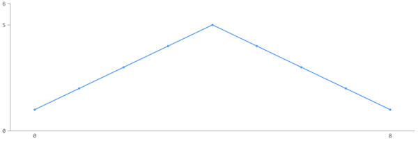

##QuickStart

This example shows how to create your first chart with Forio Contour.

###Including Contour

Forio Contour requires the following files:

* `contour.min.css`: the Forio Contour stylesheet
* `d3.js`: the data manipulation library underlying many of Contour's visualizations
* `lodash.js`: utilities and performance enhancements used by Contour
* `contour.min.js`: the Contour visualization library

See the [Get Contour](get_narwhal.html) page for information on how to download or reference these libraries.

Once you've downloaded Contour, you can load it from your own domain. In the example, `yourPath` is the location on your server, for example `/vendor/forio/js/`.

		<html>
		  <head>
		    <link rel="stylesheet" href="yourPath/contour.min.css">
		      
		      
		      
		  </head>

		  <body>
		  </body>

		</html>

###Your first Forio Contour visualization

Once you have included Contour in your webpage you can create your first visualization. We'll start with a line chart.

1. Add a `div` to your webpage and give it a `class`. Then set the `width` and `height` to be the width and height of your chart.

		

2. To create one or more visualizations, create a new Contour instance within the JavaScript tag, ``, anywhere in your webpage. You can pass in a set of configuration options. At minimum, you should pass in the element whose name matches the `class` in your `div`.

		

3. To display this Contour instance on your webpage, you need to add three more pieces to its definition:

	* The type of frame for all visualizations in this Contour instance: `.cartesian()`.
	* The particular visualization you want in this Contour instance, including its data: `.line(data)`. (Each Contour instance can display multiple visualizations. In this example, we'll just make one.)
	* An instruction for all visualizations in this Contour instance to be displayed: `.render()`.

	So your complete webpage may look like this:

		<html>
		  <head>
			<link rel="stylesheet" href="yourPath/contour.min.css">
			
			
			
		  </head>

		  <body>

			

			

		  </body>
		</html>

4. You should now see your Contour visualization on your webpage:

**What's next?**

* Browse the [example visualization](showcase.html) for inspiration
* Review the reference documentation for any questions: select from the visualizations and configuration options on the left

